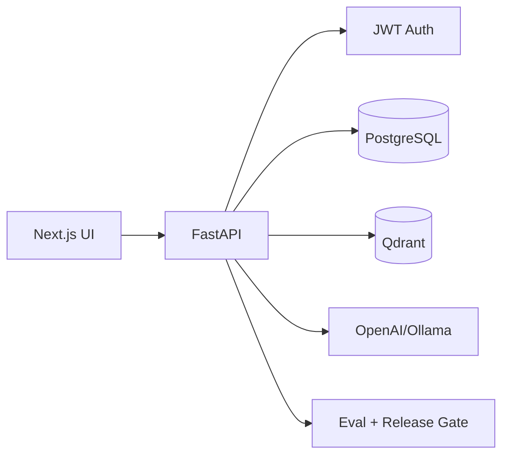

# AI Customer Support Agent (Full-Stack)

Production-style customer support platform with clear UI that explains what the backend does on every request.

## Problem

Support teams spend too much time on repetitive questions. This project answers from company documents with citations, feedback loop, and release metrics.

## Architecture



## Features

- Chat with conversation history
- RAG over uploaded docs (Qdrant + embeddings)
- Source citations in every answer
- Admin PDF/TXT upload (JWT protected)
- Feedback thumbs up/down
- Metrics dashboard (groundedness, fallback, latency, cost, release gate)

## Tech Stack

| Layer | Technology |
|------|------------|
| Frontend | Next.js 14, React, TypeScript |
| Backend | FastAPI, SQLAlchemy |
| Auth | JWT + bcrypt |
| Database | PostgreSQL |
| Vector DB | Qdrant |
| LLM | Ollama (default) or OpenAI |
| Embeddings | sentence-transformers/all-MiniLM-L6-v2 |

## Quick Start

### 1) Start infrastructure

```bash
docker compose up -d
```

### 2) Backend

```bash
cd backend
python -m venv .venv && source .venv/bin/activate
pip install -r requirements.txt
cp ../.env.example ../.env
python run.py
```

API docs: `http://127.0.0.1:8101/docs`

### 3) Frontend

```bash
cd frontend
npm install
npm run dev
```

UI: `http://localhost:3000`

## Default Admin

- Email: `admin@support.local`
- Password: `admin123`

## UI Panels (what each shows)

1. **Chat (RAG)** – user Q&A + citations + backend pipeline steps
2. **Admin Upload** – document ingestion to Qdrant + PostgreSQL metadata
3. **Metrics Dashboard** – eval/ops signals and release gate
4. **Auth** – JWT login/register flow

## API Endpoints

- `POST /api/auth/login`
- `POST /api/auth/register`
- `POST /api/admin/upload` (admin)
- `GET /api/admin/documents` (admin)
- `POST /api/chat`
- `GET /api/chat/history/{session_id}`
- `POST /api/chat/feedback`
- `GET /api/metrics`

## Evaluation Metrics

- Groundedness rate
- Fallback rate
- p50 / p95 latency
- Estimated token cost
- Feedback ratio
- Release gate (`GO` / `NO_GO`)

## Production Signals (targets)

- Groundedness >= 0.80
- Fallback rate <= 0.20
- p95 latency <= 3000ms

## Hiring Value

Demonstrates full-stack AI engineering: RAG, auth, persistence, vector search, observability, and release discipline.

## Screenshots

Add demo screenshots/GIF in `screenshots/` before interviews.

## Repo Links

- Learning monorepo: `ai-engineer-learning`
- This project: standalone portfolio repo
